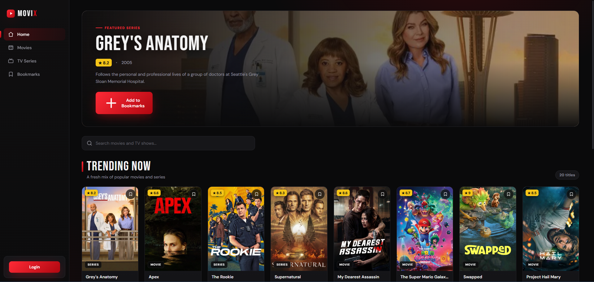
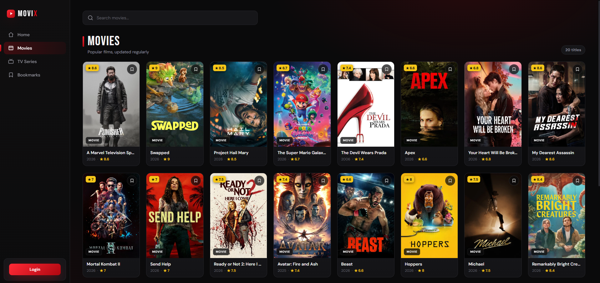
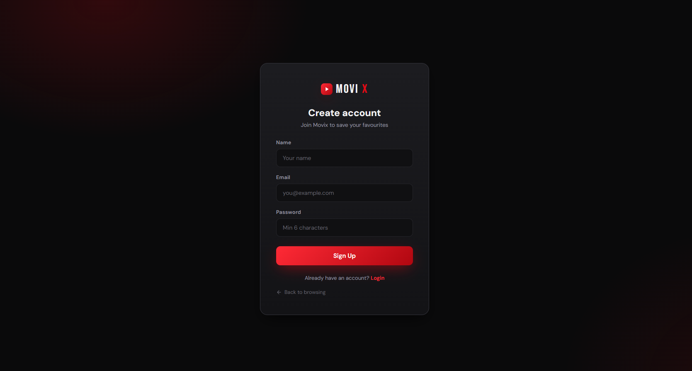

# 🎬 Movix — Movie & TV Discovery Platform

Movix is a full-stack web app for discovering trending **movies and TV shows**.
Browse popular titles, search for anything, create an account, and save your
favourites as bookmarks.

It is built with **React** on the frontend and **Node.js + Express + MongoDB**
on the backend, and it pulls movie data from the free
[TMDB API](https://www.themoviedb.org/).

---

## 📸 Screenshots

### Home


### Movies


### Login


---

## ✨ Features

- 🔥 Browse trending **movies** and **TV series**
- 🔎 Live search by title
- 👤 User accounts — **sign up / log in** (JWT authentication)
- 🔖 **Per-user bookmarks** — save titles to watch later
- 🔒 Protected routes — bookmarks are only visible when logged in
- 📱 Responsive, cinematic dark UI

---

## 🛠️ Tech Stack

| Layer        | Technology                                        |
| ------------ | ------------------------------------------------- |
| **Frontend** | React 19, Vite, React Router                      |
| **Backend**  | Node.js, Express                                  |
| **Database** | MongoDB (with Mongoose)                           |
| **Auth**     | JSON Web Tokens (JWT), bcrypt password hashing    |
| **Data**     | [TMDB API](https://developer.themoviedb.org/)     |

---

## 📁 Project Structure

```
movix/
├── backend/                # Express API server
│   ├── models/             # Mongoose schemas (User, Bookmark)
│   ├── routes/             # API routes (auth, movies, tv, bookmarks)
│   ├── middleware/         # JWT auth middleware
│   ├── server.js           # App entry point
│   └── .env                # Environment variables (you create this)
│
└── frontend/               # React app (Vite)
    ├── src/
    │   ├── components/     # Reusable UI (Navbar, Card, Hero, ...)
    │   ├── pages/          # Page views (Home, Movies, TV, Login, ...)
    │   ├── hooks/          # useAuth, useBookmark
    │   └── styles/         # CSS files
    └── index.html
```

---

## ✅ Prerequisites

Make sure you have these installed before starting:

- [Node.js](https://nodejs.org/) (v18 or newer) and npm
- [MongoDB](https://www.mongodb.com/try/download/community) running locally,
  **or** a free [MongoDB Atlas](https://www.mongodb.com/atlas) cloud database
- A free **TMDB API key** — sign up at
  [themoviedb.org](https://www.themoviedb.org/signup) and create a key under
  *Settings → API*

---

## 🚀 Getting Started

### 1. Clone the repository

```bash
git clone https://github.com/DeepikaGautam10/movix.git
cd movix
```

### 2. Set up the backend

```bash
cd backend
npm install
```

Create a file named `.env` inside the `backend/` folder
(you can copy `.env.example`) and fill in your own values:

```env
MONGO_URI=mongodb://localhost:27017/movixdb
TMDB_API_KEY=your_tmdb_api_key_here
JWT_SECRET=any_long_random_secret_string
PORT=5000
```

> 💡 **JWT_SECRET** can be any random string — it just needs to be present
> and kept private. The app will not be able to log users in if it is empty.

Start the backend server:

```bash
npm run dev      # auto-restarts on changes (nodemon)
# or
npm start        # plain start
```

The API will run at **http://localhost:5000**.

### 3. Set up the frontend

Open a **new terminal** and run:

```bash
cd frontend
npm install
npm run dev
```

The app will open at **http://localhost:5173**.

> The frontend automatically forwards any `/api/...` request to the backend
> on port 5000 (configured in `vite.config.js`), so both servers must be
> running at the same time.

---

## 🔌 API Endpoints

| Method   | Endpoint            | Description                      | Auth required |
| -------- | ------------------- | -------------------------------- | ------------- |
| `POST`   | `/auth/signup`      | Create a new account             | No            |
| `POST`   | `/auth/login`       | Log in and receive a JWT         | No            |
| `GET`    | `/movies`           | Popular movies (paginated)       | No            |
| `GET`    | `/movies/search`    | Search movies by title           | No            |
| `GET`    | `/tv`               | Popular TV shows (paginated)     | No            |
| `GET`    | `/tv/search`        | Search TV shows by title         | No            |
| `GET`    | `/bookmarks`        | Get the logged-in user's saves   | Yes           |
| `POST`   | `/bookmarks`        | Add a bookmark                   | Yes           |
| `DELETE` | `/bookmarks/:id`    | Remove a bookmark                | Yes           |

---

## 🧠 How It Works (Quick Overview)

1. The **backend** talks to the TMDB API, reshapes the data, and exposes its
   own simple endpoints (with a short in-memory cache to reduce API calls).
2. When you **sign up / log in**, the server returns a **JWT token**. The
   frontend stores it in `localStorage` so you stay logged in after a refresh.
3. **Bookmarks** are tied to your user account — every bookmark request sends
   the token, and the server only returns *your* saved titles.

---

## 🩹 Troubleshooting

- **"Signup failed" / can't log in** → make sure `JWT_SECRET` in `backend/.env`
  is **not empty**, then restart the backend.
- **No movies loading** → check that your `TMDB_API_KEY` is valid.
- **Database errors** → confirm MongoDB is running and `MONGO_URI` is correct.
- **API requests failing** → both the backend (port 5000) and frontend
  (port 5173) need to be running together.

---

## 📜 License

This project is for **learning and portfolio purposes**.
Movie data is provided by [TMDB](https://www.themoviedb.org/) — Movix is not
endorsed or certified by TMDB.

---

> Built as a learning project to practice full-stack development with the
> MERN stack. ⭐ Star the repo if you find it helpful!
